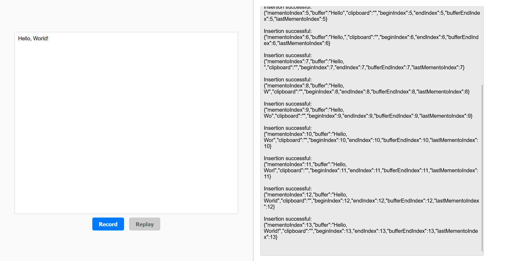

# The Mini Text Editor Project

by **Benedict Wolff**, M1 Informatique CNI at the University of Rennes ISTIC for Object-Oriented Analysis and Design (ACO) 2024 under the supervision of **Adrian Le Roch**.

Provided below is an overview of the editor's [features](#Features), what [commands](#Commands) are supported, how to [download and run any of its releases](#downloading-and-running-a-released-version), and instructions on [how to build the editor from its source code](#how-to-build-the-editor-from-source-code). Further documentation can be found here:
- [Application design](./docs/design.md)
- [Application architecture](./docs/architecture.md)
- [Javadoc](./docs/javadoc/index.html)

PDF prints of the documentation can be found [here](./docs/pdf).

---

## Features

- **Graphical user interface (GUI)**:
    - The GUI supports inserting, deleting, selecting, copying, cutting, and pasting text as well as undoing and redoing actions.
    - Actions can be recorded and replayed.
    - Every action is logged in the frontend to give the user feedback on changes to the engine's state.

- **Modular Backend**:
    - The application is built with Spring Boot, the industry standard for production-grade Java applications.
    - The backend is seperated into the core engine, the service, and the controller layer.
    - The Command Design Pattern is used for invoking commands.
    - The Memento Design Pattern is used for the undo/redo functionality.

- **REST API**:
    - Ten REST endpoints are available for operating the editor engine.
    - All endpoints are managed by the engine controller for easy API maintenance and extension.

- **Testing**:
    - Over 100 JUnit tests have been written to ensure the correct functionality of the editor.
    - The tests cover 93% test of all classes, branches and lines of the backend.

## Commands

| **Command** | **Description**                                                                                         |
|-------------|---------------------------------------------------------------------------------------------------------|
| Insert      | any single character                                                                                    |
| Select      | `SHIFT` + `→`, `SHIFT` + `←` or use the mouse                                                           |
| Select all  | `SHIFT` + `A`                                                                                           |
| Delete      | `Backspace`                                                                                             |
| Copy        | `CTRL` + `C`                                                                                            |
| Cut         | `CTRL` + `X`                                                                                            |
| Paste       | `CTRL` + `V`                                                                                            |
| Undo        | `CTRL` + `Z`                                                                                            |
| Redo        | `CTRL` + `Y`                                                                                            |
| Record      | The editor starts recording every further action.                                                       |
| Replay      | The editor replays every recorded action individually in the backend until it reaches the latest state. |

## Downloading and running a released version

### Prerequisites

- Java 17 or later
- A browser (e.g., Chrome, Firefox).

### Download and run a release

All releases of the mini text editor can be found [here](https://github.com/wolffbe/minitexteditor/releases).

After downloading any of the published `.jar` releases, simply execute the following command in the same folder as the `.jar` file to run the editor:
  
    java -jar editor-{version}.jar

Each release also contains a downloadable `.zip` file that includes the editor's source code and the unit tests written for each version.

Access the frontend of the mini text editor in your browser of choice by opening the following URL:

    http://localhost:8080

## How to build the editor from source code

### Prerequisites

- Java 17 or later
- Maven
- A browser (e.g., Chrome, Firefox).

### Build the editor

Clone the repository:

    git clone https://github.com/bjpw/minitexteditor.git
    cd minitexteditor

Build the Spring application:

    mvn clean install

A `.jar` file will have been created in the `target` folder.

### Run the editor

(Optional) Run the unit tests:

    mvn test

Run the Spring application

    mvn spring-boot:run

Access the frontend of the mini text editor in your browser of choice by opening the following URL:

    http://localhost:8080