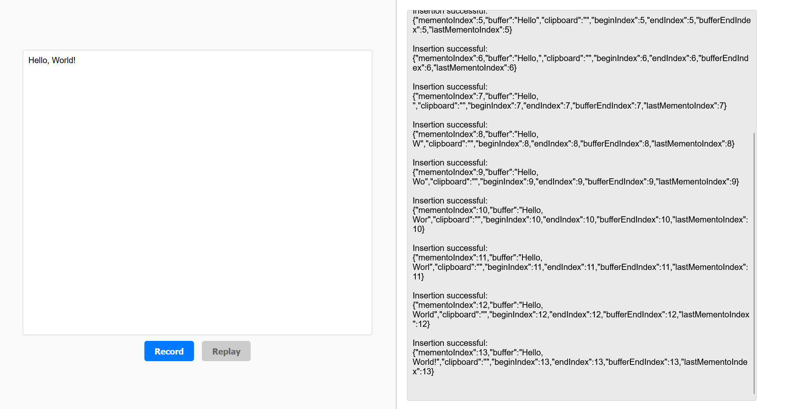

# The Mini Text Editor Project

by **Benedict Wolff**, M1 Informatique CNI at the University of Rennes ISTIC for ACO 2024 under the supervision of **Adrian Le Roch**.

Below is an overview of the editor's [features](#Features), what [commands](#Commands) it supports, and instructions on [how to build and run](#how-to-build-and-run-the-editor) the application. Further documentation can be found here:
- [Architecture](./docs/architecture.md)
- [UML diagram](./docs/uml.md)
- [Javadoc](./docs/javadoc/index.html)

---

## Features

- **User Interface**:
    - The text editor supports inserting, deleting, selecting, copying, cutting, pasting, undoing and redoing.
    - Recording and replaying actions individually in the backend.
    - Actions are logged in the frontend to give the user feedback on changes to the engine's state.

- **Modular Backend**:
    - Implements the Command Design Pattern for invoking commands.
    - Memento Design Pattern for the undo/redo functionality.
    - Separation of concerns with core engine, service, and controller layers.

- **REST API**:
    - Ten REST endpoints for operating the editor engine.
    - Built with Spring Boot for scalability and maintainability.

- **Testing**:
    - over 100 JUnit tests including mocked classes using Mockito.
    - over 93% test coverage of all backend classes, branches and lines.

## Commands

| **Command** | **Description**                                                             |
|------------|-----------------------------------------------------------------------------|
| Insert     | any single character                                                        |
| Select     | `CTRL` + `A` for everything, `SHIFT` + `→`, `SHIFT` + `←` or use the mouse  |
| Delete     | `Backspace`                                                                 |
| Copy       | `CTRL` + `C`                                                                |
| Cut        | `CTRL` + `X`                                                                |
| Paste      | `CTRL` + `V`                                                                |
| Undo       | `CTRL` + `Z`                                                                |
| Redo       | `CTRL` + `Y`                                                                |
| Record     | The editor starts recording every further action.                           |
| Replay     | The editor replays every recorded action individually until its last state. |

## How to build and run the editor

### Prerequisites

- Java 17 or later
- Maven
- A browser (e.g., Chrome, Firefox).

### Build

_This step can be skipped, and an existing .jar file [run](#run) straight away._

Clone the repository:

    git clone https://github.com/bjpw/editor.git
    cd editor

Build the Spring backend:

    mvn clean install

### Run

Run the Java application:

    cd target
    java -jar editor-3.0.jar

Open the frontend in your browser of choice:

    http://localhost:8080