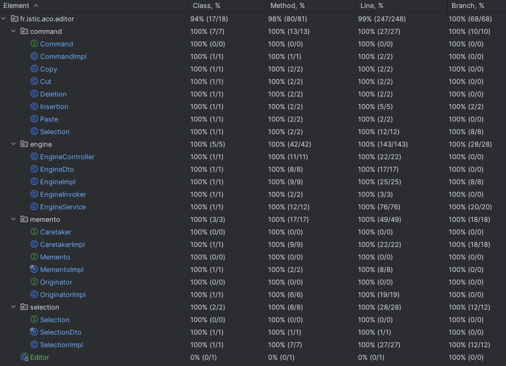

# Application design

The Mini Text Editor consists of a web-based frontend as well as a REST API and a backend written in Java. Over 100 unit tests covering over 90% of the backend were written using JUnit and Mockito. This document contains an overview and descriptions of all design choices that were made during the implementation of each component.

1. [Frontend](#1-frontend)
2. [REST API](#2-rest-api)
3. [Backend](#3-backend)
4. [Testing](#4-Testing)

## **1. Frontend**

The frontend of the application is built using plain **HTML**, **CSS**, and **JavaScript**, providing a user-friendly interface for interacting with the text editor. The following design choices were made during its implementation:

| **Design choice**                           | **Description**                                                                                                                                                                                                                                                                         |
|---------------------------------------------|-----------------------------------------------------------------------------------------------------------------------------------------------------------------------------------------------------------------------------------------------------------------------------------------|
| simple and straight-forward GUI             | The GUI consists of only four elements visible to the user: the text field, the log, the record button and the replay button.                                                                                                                                                           |
| plain JavaScript                            | The goal was to use as little additional frameworks as possible for the frontend. For that reason, it was written in plain JavaScript.                                                                                                                                                  |
| const.js                                    | Constants are centrally managed in the consts.js to avoid scattering their definitions across multiple JavaScript files.                                                                                                                                                                |
| logs displayed in the frontend              | Each action creates a log straight in the frontend to prove the correct functionality of the editor to the user. That way, the user does not have to switch between the multiple windows to evaluate the editor's correct functionality.                                                |
| logs.js                                     | The logic handling logging in the frontend is centrally located in the log.js                                                                                                                                                                                                           |
| use of keyboard shortcuts                   | Existing and well-known keyboard shortcuts for editing text are used to keep the number of buttons in the user interface as low as possible.                                                                                                                                            |
| centrally managed keyboard events           | Each keyboard stroke triggers an event that is handled by a centralized listener. The listener is aware of all valid keyboard events, and what following command needs to be executed as a result. Managing all keyboard events in one place allows easy maintenance and extensibility. |
| checking for selection changes              | Before a selection command is executed, the frontend checks whether the selection has changed. If the selection has not changed, no REST API call is executed. This is useful to reduce the amount of API calls.                                                                        |
| asynchronous backend requests               | Each valid keyboard stroke and keyboard shortcut has one asynchronous function associated to it. Each of these functions know what command was executed, and what API endpoint with what data needs to be called to execute a user action.                                              |
| standardized REST API calls               | Each asynchronous function executing a command follows a standardized structure. The API is prepared, executed, and the response evaluated, either successfully or with an error as a result.                                                                                           |
| one file per command                        | Each command function is written in its own file. The result is a modular structure that allows easy maintainability and extensibility.                                                                                                                                                 |
| separation of commands and state management | The logic to update the engine state in the frontend is independent of all commands. Separating concerns allows more flexibility in deciding at what point the engine state should be updated.                                                                                          |
| replaying in the backend                    | A replay is the indiviudal exeuction of past commands as of a given state. This feature is entirely handled by the backend to keep the frontend as simple as possible.                                                                                                                  |

## **2. REST API**

The **REST API** serves as the communication layer between the backend and frontend. The API supports the following endpoints served at `/api/engine`:

| **Method** | **Endpoint** | **Description**                           |
|------------|--------------|-------------------------------------------|
| GET        | `/`       | Returns the current state of the engine.  |
| POST       | `/select`    | Updates the text selection indices.       |
| POST       | `/cut`       | Cuts the selected text to the clipboard.  |
| POST       | `/copy`      | Copies the selected text to the clipboard. |
| POST       | `/paste`     | Pastes the clipboard content.             |
| POST       | `/insert`    | Inserts text into the buffer.             |
| DELETE     | `/delete`    | Deletes the selected text.                |
| GET        | `/replay`    | Replays recorded actions.                 |
| POST       | `/undo`      | Reverts the last action.                  |
| POST| `/redo`      | Redoes the last undone action.

The following design choices were made when implementing the REST API:

| **Design choice**        | **Description**                                                                                                                                                                                                     |
|--------------------------|---------------------------------------------------------------------------------------------------------------------------------------------------------------------------------------------------------------------|
| separation of concerns   | The REST API in the backend is implemented in the engine controller. The controller immediately handles the request to the command's associated function in the service, and forwards its response to the frontend. |
| one endpoint per command | Having one endpoint per command creates an independence in between all commands. The result is easier maintainability and extensibility.                                                                            |
| data transfer objects    | The use of data transfer objects allows easier JSON parsing in the frontend.                                                                                                                                        |
| use of Optionals         | Returning Optionals gives the frontend the ability to handle an empty response without error. This is usually the case when an action is valid, yet unnecessary, e.g. pasting an empty clipboard.                   |

## **3. Backend**

The backend of the application is a Java application based on Spring Boot that exposes a REST API to the frontend hosted on the same server as the backend. The following design choices were made during its implementation:

### a. Spring Boot

Spring Boot is used as it is the industry standard for Java applications. Knowing that the frontend would be web-based and require a REST API, Spring Boot was used as it allows to quickly implement such services.

### b. Maven

Maven is used as a build tool as it offers the widest range of functionality as well as highest degree of optimization for Spring Boot applications.

### c. Layered architecture

The application is designed using a layered architecture to ensure a clear separation of concerns and modularity.

- The **controller layer** exposes endpoints that allow the frontend to interact with the backend and trigger specific text editing operations.
- The **service layer** responsible for invoking commands and managing the application’s state in response to incoming requests from the frontend.
- The **component layer** implements the core logic of the text editor and is responsible for handling key operations such as text manipulation, selection, clipboard, and buffer management.

### d. Memento

The Memento design pattern is used to implement undo/redo functionality in the text editor by capturing and storing snapshots of the application's state.
It enables the application to revert to a previous state (undo) or reapply a state that was reverted (redo), making it easy to track and manage changes over time.

When saving an engine state, the originator manipulates its instance of the engine by using its methods directly, and not by invoking them.
The reason for this implementation is that adding code to use an Invoker artificially increased the class in size. The correct use of the Command pattern was already proven in the service layer.
Using a second constructor would have been an ideal alternative. However, to conform with the spiral method, the given solution served the same purpose without needing to extend older components.

### e. Command

The Command design pattern is used to encapsulate all text editing operations (such as Cut, Copy, Paste, Undo, and Redo) as command objects, decoupling the request from the execution logic. Each command represents an action, and the editor invokes these commands through an Invoker, which allows for consistent execution of different operations without direct coupling to the engine's core logic.

### f. Packaged architecture

As the editor grew in functionality over time, major functionalities were arranged into four packages.
- Engine: contains the core functionality to insert, edit and delete text.
- Selection: contains the functionality to select text.
- Memento: contains all functionality to undo and redo actions.
- Command: contains all functionality to decouple a command request from its execution logic.

### g. Preconditions

Wherever technically reasonable, class constructors and methods contain preconditions to avoid NullPointerExceptions. Error messages are usually phrased in detail as well as in a less technical and rather more logical manner.

### h. Javadoc

Each class contains Javadoc comments on a class and method level. In case preconditions are used in a method, the condition itself and the result of not meeting it is described in the Javadoc of the method it is used in.

## **4. Testing**

### **Frontend**

The frontend was thoroughly tested manually throughout its implementation. Due to time constraints, no additional unit tests were written for it.

### **Backend**

| **Design choice**          | **Description**                                                                                                                                                                                                |
|----------------------------|----------------------------------------------------------------------------------------------------------------------------------------------------------------------------------------------------------------|
| JUnit 5                    | JUnit 5 is used as it is the standard for writing unit tests in Java.                                                                                                                                          |
| High test coverage         | The ambition was to achieve a test coverage of at least 90%.                                                                                                                                                   |
| Test-driven development    | During the implementation process, tests were written for all possible outcomes by default. While testing the frontend, any bugs were reproduced in the form of their own unit test before before being fixed. |
| Mockito                    | Mockito is used to mock dependencies of a component being tested that would have otherwise required significant configuration to reproduce any wanted testing scenario.                                        |
| @AutoClosable              | Using @AutoCloseable in Mockito ensure that mocks are automatically closed after the test execution, helping prevent resource leaks and simplifying cleanup in unit tests.                                     |
| @Nested                    | Nested test classes are used whenever there are more than two test cases for one method to increase the readability and structure of a test class.                                                             |
| @ParameterizedTest         | Parameterized tests were used to test different scenarios with different values, e.g. different values for `beginIndex` and `endIndex` when testing selections.                                                |
| Not testing the main class | The main method's functionality, invoking the Spring Boot lifecycle, is well-tested by the framework itself. Re-testing it in your application provides little additional value.                               |

