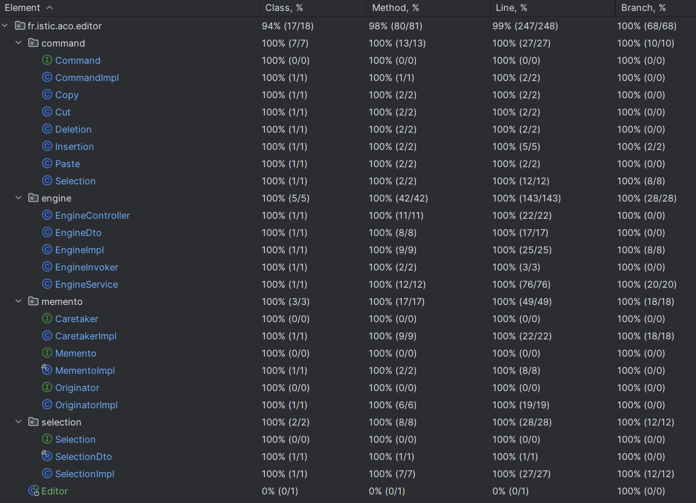

# Application Design

The Mini Text Editor features a web-based frontend, which interacts with a REST API and a backend written in Java. To ensure the robustness and correctness of the backend, over 100 unit tests were written using JUnit and Mockito, achieving over 90% test coverage. These tests verify the functionality of various backend components, ensuring the editor performs efficiently and reliably.

This section provides an overview of the design decisions made during the development of the application and the rationale behind each choice.

_Click here to get back to the [README](../README.md)._

## **Table of Contents**

1. [Frontend](#frontend)
2. [REST API](#rest-api)
    - [Endpoints](#endpoints)
    - [Design Choices](#design-choices)
3. [Backend](#backend)
    - [Design choices](#design-choices)
    - [Memento design pattern](#memento-design-pattern)
4. [Testing](#testing)

---

## **Frontend**

The frontend of the application is built using plain **HTML**, **CSS**, and **JavaScript**, providing a user-friendly interface for interacting with the text editor. The following design choices were made during its implementation:

| **Design choice**                           | **Description**                                                                                                                                                                    | **Reason**                                                                                                                                                                                                                                                                                                                                                       |
|---------------------------------------------|------------------------------------------------------------------------------------------------------------------------------------------------------------------------------------|------------------------------------------------------------------------------------------------------------------------------------------------------------------------------------------------------------------------------------------------------------------------------------------------------------------------------------------------------------------|
| simple and straightforward GUI              | The GUI consists of only four elements visible to the user: the editor text area, the log area, the record button, and the replay button.                                          | A simple and straightforward GUI reduces visual complexity, making the editor more intuitive and easier for users to interact with.                                                                                                                                                                                                                              |
| plain JavaScript                            | Logical components of the frontend are written entirely in plain JavaScript.                                                                                                       | Plain JavaScript avoids introducing unnecessary dependencies, ensuring a lightweight, maintainable implementation.                                                                                                                                                                                                                                               |
| `const.js`                                  | All constants used in the frontend are centrally managed in `const.js`, being the first JavaScript file included in the HTML of the frontend.                                      | Managing all `const` in one place allows easy maintenance by providing a single location for updates to constants.                                                                                                                                                                                                                                               |
| logs displayed in the frontend              | Each action creates a log directly in the frontend.                                                                                                                                | Providing logs in the frontend enables users to verify the results of their actions without needing to switch to another window, improving usability.                                                                                                                                                                                                            |
| `log.js`                                    | The logic handling logging in the frontend is centrally located in `log.js`.                                                                                                       | Centralized logging keeps this functionality modular and separated, making it easier to manage and debug.                                                                                                                                                                                                                                                        |
| use of keyboard shortcuts                   | Existing and well-known keyboard shortcuts for editing text are used.                                                                                                              | Using familiar keyboard shortcuts makes it easy for the user to interact with the editor.                                                                                                                                                                                                                                                                        |
| centrally managed keyboard events           | Each keyboard stroke triggers an event handled by a centralized listener. The `listeners.js` is aware of all valid keyboard events and the associated command function to execute. | Centralizing event handling into a single point makes the system easier to maintain and extend.                                                                                                                                                                                                                                                                  |
| checking for selection changes              | Before executing a selection command function, the frontend checks whether the selection has changed. If not, no REST API call is executed.                                        | These kind of checks reduce unnecessary API calls, improving performance and reducing server load.                                                                                                                                                                                                                                                               |
| asynchronous backend requests               | Each valid keyboard stroke and shortcut triggers an associated asynchronous command function that calls its backend counterpart via the REST API.                                  | Asynchronous backend requests ensure a responsive user experience by allowing the frontend to remain interactive while waiting for the backend to process requests. It also decouples the frontend from backend implementation details, allowing for better scalability, error handling, and non-blocking operations, which improves overall system performance. |
| standardized REST API calls                 | Each asynchronous function executing a command follows a standardized structure for API call preparation, execution, and response evaluation (success or error).                   | This ensures debugging and consistent handling of API interactions.                                                                                                                                                                                                                                                                                              |
| one file per command                        | Each command function is written in its own file.                                                                                                                                  | Individual files support modularity and simplify extending the functionality of the editor.                                                                                                                                                                                                                                                                      |
| separation of commands and state management | The logic to update the engine state in the frontend is independent of all commands.                                                                                               | This decoupling grants flexibility in deciding when and how to update the engine state without bounding it to specific commands.                                                                                                                                                                                                                                 |
| separation of commands and logging          | The logic to log changes to the engine state in the frontend is independent of all commands and state management.                                                                  | This decoupling creates modularity and independence between functional components such as commands and technical components such as logging and state management.                                                                                                                                                                                                |
| replaying in the backend                    | A replay is the individual execution of past commands as of a given state. This feature is handled entirely by the backend.                                                        | Executing the replay in the backend keeps the frontend lightweight.                                                                                                                                                                                                                                                                                              |

---

## **REST API**

The **REST API** serves as the communication layer between the backend and frontend.

### Endpoints

The API services the following endpoints at `/api/engine`:

| **Method** | **Endpoint** | **Description**                            |
|------------|--------------|--------------------------------------------|
| GET        | `/`          | Returns the current state of the engine.   |
| POST       | `/select`    | Updates the text selection indices.        |
| POST       | `/cut`       | Cuts the selected text to the clipboard.   |
| POST       | `/copy`      | Copies the selected text to the clipboard. |
| POST       | `/paste`     | Pastes the clipboard content.              |
| POST       | `/insert`    | Inserts text into the buffer.              |
| DELETE     | `/delete`    | Deletes the selected text.                 |
| GET        | `/replay`    | Replays recorded actions.                  |
| POST       | `/undo`      | Reverts the last action.                   |
| POST       | `/redo`      | Redoes the last undone action.             |

### **Design choices**

The following design choices were made during the implementation of the REST API:

| **Design choice**        | **Description**                                                                                                                                  | **Reason**                                                                                                          |
|--------------------------|--------------------------------------------------------------------------------------------------------------------------------------------------|---------------------------------------------------------------------------------------------------------------------|
| separation of concerns   | The REST API is implemented in the engine controller, forwarding requests to the associated service function and then responding to the frontend. | This approach ensures a modular architecture, making debugging and updates to individual layers easier.             |
| one endpoint per command | Each command has its own endpoint.                                                                                                               | Individual endpoints result in clear separation of functionality and easier extensibility for new commands.         |
| data transfer objects    | Data transfer objects (DTOs) are used as response entities for each API call.                                                                    | DTOs reduce coupling between the frontend and the backend while making the API easier to work with.                 |
| use of Optionals         | Optionals enable the API to return empty responses without error.                                                                                | Optionals prevent errors caused by empty responses, and allow the frontend to act upon empty responses accordingly. |

---

## **Backend**

The backend of the application is a Java application based on Spring Boot that exposes a REST API to the frontend hosted on the same server as the backend.

## **Design choices**

The following design choices were made during its implementation:

| **Design choice**                   | **Description**                                                                                             | **Reason**                                                                                                                                             |
|-------------------------------------|-------------------------------------------------------------------------------------------------------------|--------------------------------------------------------------------------------------------------------------------------------------------------------|
| Spring Boot                         | Spring Boot is used to implement the backend.                                                               | It is the industry standard for creating Java-based web applications and REST APIs, offering robust tools and frameworks.                              |
| Maven                               | Maven is used as the build tool for the backend.                                                            | Maven simplifies dependency management and supports the creation of reproducible builds.                                                               |
| Layered architecture                | A layered architecture separates the controller, service, and component layers.                             | The result of using this architecture is modularity and clear separation of concerns for easier testing and maintenance.                               |
| Memento design pattern              | Undo/redo functionality is generically implemented using the Memento pattern.                               | The Memento design pattern simplifies application state management by storing snapshots of the engine's state, enabling easy undo and redo operations. |
| Generic memento classes             | The memento classes are generic.                                                                            | Generic classes offers easy reusability.                                                                                                               |
| Command design pattern              | Text editing operations are encapsulated as command objects.                                                | This pattern decouples the command request from its execution, making operations consistent and easier to extend.                                      |
| Immutability of previous iterations | The engine is manipulated in the Originator without the use of a dedicated deep copy method or constructor. | Ensuring the immutability of previously implemented components reduces the time needed to review newer code contributions.                             |
| Packaged architecture               | Functionalities are grouped into four packages: Engine, Selection, Memento, and Command.                    | Such a structure makes it easier to locate and manage related functionalities, supporting modular development.                                         |
| Preconditions                       | Methods include preconditions checked before the method is executed.                                        | Preconditions improve code robustness by ensuring invalid states are avoided and errors are clear and informative.                                     |
| Javadoc                             | Javadoc is used extensively for classes and methods.                                                        | Javadocs provide clear documentation for developers, aiding maintainability and reducing the time to understand the code.                              |

### **Memento design pattern**

The **Memento pattern** is used to store snapshots of the application's state. This allows the text editor to implement undo and redo functionality. The pattern consists of three components:
- **Memento**: Stores the state.
- **Originator**: Creates and restores mementos.
- **Caretaker**: Manages the history of mementos for navigation (undo/redo).

---

## **Testing**

### **Frontend**

The frontend was thoroughly tested manually throughout its implementation. Due to time constraints, no additional unit tests were written for it.  

### **Backend**

| **Design choice**          | **Description**                                                               | **Reason**                                                                                                               |
|----------------------------|-------------------------------------------------------------------------------|--------------------------------------------------------------------------------------------------------------------------|
| JUnit 5                    | JUnit 5 is used for unit testing.                                             | It is the standard for testing Java applications, offering modern features and extensive community support.              |
| High test coverage         | Over 90% test coverage for the backend is achieved.                           | High test coverage ensures the reliability of the application by thoroughly validating its components.                   |
| Test-driven development    | Tests were written before fixing a bug.                                       | This approach ensures that code is validated based on its use and not only based on its implementation.                  |
| Mockito                    | Mockito is used to mock dependencies in unit tests.                           | Mockito simplifies testing by isolating components and simulating dependencies without requiring complex configurations. |
| `@AutoClosable`            | Mocks are automatically closed after test execution using `@AutoCloseable`.   | This prevents resource leaks and reduces the complexity of test cleanup.                                                 |
| `@Nested`                  | Nested test classes are used for methods with more than two test cases.       | Nested test classes improve readability and organization of test cases.                                                  |
| `@ParameterizedTest`       | Parameterized tests allow multiple values to be tested for the same scenario. | This approach reduces redundancy and improves coverage by enabling tests with different input values.                    |
| Not testing the main class | The main method's functionality is not explicitly tested.                     | It is already covered by the Spring Boot framework, making additional testing redundant.                                 |

