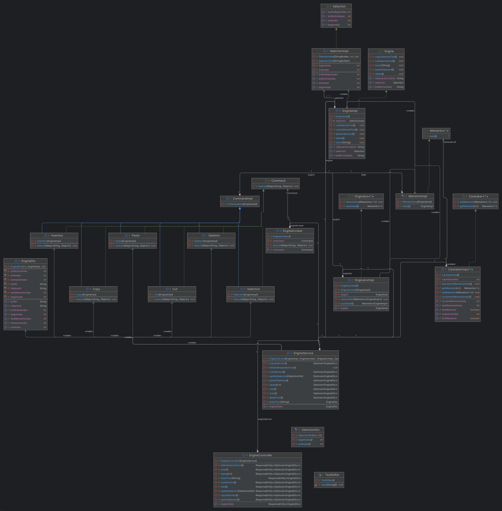

# **UML Diagram**

The UML diagram represents the architecture and relationships of the **Mini Text Editor** application. Below is an explanation of its components and overall relationships.

## **Table of Contents**
1. [Core Components](#1-core-components)
    - [Engine](#engine)
    - [Selection](#selection)
    - [Command](#command)
    - [Memento](#memento)
    - [Controller](#controller)
    - [Service](#service)
2. [Relationships](#3-relationships)

---

### **1. Core Components**

#### **Engine**
The **Engine** is the central component that manages the text being edited, as well as other core operations such as text manipulation, clipboard handling, and selection management.

- The **`EngineImpl`** class is responsible for managing the following:
    - **The text buffer**: This represents the current text in the editor.
    - **The clipboard**: This stores the text that has been copied or cut.
    - **The selection**: This tracks the selected portion of the text using start and end indices.

- The **key responsibilities** of the `EngineImpl` class include:
    - Performing operations such as `insert`, `delete`, `copySelectedText`, `cutSelectedText`, and `pasteClipboard`.
    - Coordinating with `SelectionImpl` to manage and update the current selection state.
    - Ensuring the integrity of the text buffer and clipboard.

---

#### **Selection**
The **Selection** component is responsible for managing the selection of text within the buffer. It abstracts the concept of selecting text and allows operations like cut, copy, and paste to be applied to the selected portion of the text.

- The **`Selection` interface** defines methods for getting and setting the start (`beginIndex`) and end (`endIndex`) of the selection.
- The **`SelectionImpl` class** implements the `Selection` interface and tracks:
    - `beginIndex`: The start index of the current selection.
    - `endIndex`: The end index of the current selection.
    - `bufferBeginIndex` and `bufferEndIndex`: These represent the start and end indices of the text buffer.

- The `SelectionImpl` class works closely with `EngineImpl` to ensure that selections are accurately updated during operations such as inserting, deleting, copying, or pasting text.

---

#### **Command**
The **Command** pattern is used to encapsulate various operations that the user performs, such as cutting, copying, pasting, and undoing actions, into command objects. This allows for flexible and reusable operations.

- The **`Command` interface** defines a single method, `execute`, which must be implemented by all command classes.

- Several **concrete command classes** implement the `Command` interface to handle specific actions:
    - **`Copy`**: Copies the selected text to the clipboard.
    - **`Cut`**: Copies the selected text to the clipboard and removes it from the text buffer.
    - **`Paste`**: Pastes the clipboard content at the current selection.
    - **`Insertion`**: Adds new text at the current selection.
    - **`Deletion`**: Removes the selected text from the buffer.
    - **`Selection`**: Updates the selection indices based on user input.

- These commands interact with the `EngineImpl` to execute their respective operations.

- The **`EngineInvoker` class** is responsible for invoking these commands. It decouples the command execution logic from the rest of the application, ensuring that the commands can be executed independently of the main logic.

---

#### **Memento**
The **Memento** pattern is used to implement undo and redo functionality by capturing and storing snapshots of the application’s state, allowing the system to revert to previous states or reapply undone actions.

- The **`Memento` interface** defines the behavior of capturing and restoring the state of an object, in this case, the state of `EngineImpl`.

- The **`MementoImpl` class** stores snapshots of the state of `EngineImpl`. These snapshots include:
    - The current content of the text buffer.
    - The clipboard contents.
    - The selection indices (start and end).

- The **`CaretakerImpl` class** manages the list of `Memento` objects. It tracks the current position in the undo/redo history and provides methods to navigate backward (undo) or forward (redo) through the history of mementos.

- The **`OriginatorImpl` class** is responsible for creating new mementos based on the current state of the `EngineImpl` and restoring the engine’s state from a given memento.

---

#### **Controller**
The **Controller** component exposes the functionality of the text editor as a RESTful API. It handles incoming HTTP requests and routes them to the appropriate methods in the service layer.

- The **`EngineController` class** exposes endpoints for various operations, such as `/copy`, `/undo`, and `/redo`. These endpoints correspond to the actions in the core engine.
- The controller layer accepts requests from the frontend, delegates the operations to the `EngineService`, and returns the results, such as the updated state of the engine, to the client.

---

#### **Service**
The **Service** layer acts as the intermediary between the REST API and the core engine logic. It manages the application’s operations and communicates with the controller layer to process requests.

- The **`EngineService` class** is responsible for:
    - Executing commands via the `EngineInvoker`.
    - Managing the undo/redo history using `CaretakerImpl` and `OriginatorImpl`.
    - Providing higher-level operations for tasks like clipboard management, selection updates, and command replay.

---

### **2. Relationships**

- **Engine and Selection**:
    - The `EngineImpl` class depends on `SelectionImpl` to manage the selection within the text buffer, ensuring that the correct portion of the text is selected during operations like cut, copy, and paste.

- **Commands and Engine**:
    - Each command (e.g., `Copy`, `Cut`) interacts with `EngineImpl` to execute its specific task. Commands are executed through the `EngineInvoker`, which decouples the invocation from the logic of the core engine.

- **Undo/Redo Management**:
    - The `CaretakerImpl` class manages the history of `Memento` objects. It keeps track of the state of the engine during each operation and allows the user to undo or redo actions by navigating through the history.
    - The `OriginatorImpl` class handles the creation and restoration of mementos, ensuring the correct state is restored during undo and redo operations.

- **REST API**:
    - The `EngineController` class communicates with the `EngineService` to execute the appropriate commands, manage the undo/redo history, and return the engine’s state as a response to API requests.